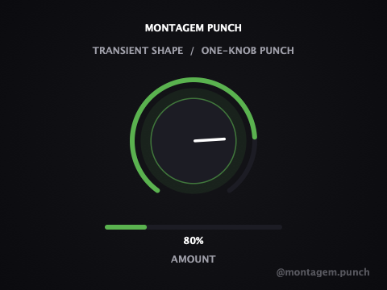

# Montagem Punch

**A one-knob transient shaper, third piece of the [Montagem](https://github.com/nabsei/montagem-finisher) mixing chain.**

Turn the single `Amount` knob to boost the attack of each hit and pull down
its sustain, adding contrast and punch — no separate attack/release/threshold
controls to fight with. Built with [JUCE](https://juce.com/), ships as
VST3 / AU / Standalone on macOS and Windows.

<p align="center">
  
</p>

<p align="center">
  <strong><a href="https://github.com/nabsei/montagem-punch/releases/latest">⬇ Download the latest beta</a></strong> — macOS and Windows, free.
</p>

<p align="center">
  Also listed on <a href="https://www.kvraudio.com/product/montagem-punch-by-montagem">KVR Audio</a>.
</p>

## Why one knob

Same philosophy as the rest of the Montagem chain: one macro parameter, no
configuration. `Amount` drives a fast/slow envelope-follower pair that
detects "we're inside a transient right now" and applies boost/cut
accordingly — classic transient-designer technique, without needing to
understand attack/release/threshold to get a usable result.

## Status

Early-stage / actively developed public beta.

This repository shows the plugin's **architecture**: JUCE plugin wrapper,
custom UI, parameter handling, state save/load. The exact DSP calibration
used in the shipped/tested build (envelope time constants, boost/cut curve,
detector sensitivity) is simplified in `Source/PunchProcessor.cpp` here —
that tuning is the actual product, not open source at this stage.

## Features

- Single macro parameter (`Amount`) driving attack boost + sustain cut together
- **Live-reacting UI**: unlike a static knob-only display, the meter below
  the knob reflects the detector's real-time reading of incoming audio —
  verified end-to-end (audio in → detector → UI) during development, not
  just the underlying gain math in isolation
- Soft-knee safety limiting only engages above ceiling, so normal-level
  material is untouched — no flat-top clipping on the boosted transients
- Denormal-safe processing and parameter smoothing (no zipper noise)
- Builds as **VST3**, **AU** (passes `auval` validation), and a **Standalone** app

## Tech stack

- C++17, [JUCE](https://github.com/juce-framework/JUCE) (audio processing + UI)
- CMake + Ninja

## Building

```bash
git clone --depth 1 https://github.com/juce-framework/JUCE.git libs/JUCE
cmake -B build -G Ninja -DCMAKE_BUILD_TYPE=Release
cmake --build build
```

On macOS, add `-DCMAKE_OSX_ARCHITECTURES="arm64;x86_64"` to the configure step
to build a universal binary (Apple Silicon + Intel) instead of the host-only
default. The official beta releases are built this way.

## Project structure

```
Source/
  PluginEntry.cpp        JUCE plugin entry point
  PunchProcessor.*        AudioProcessor: parameters, DSP, state save/load
  PluginEditor.*           Custom UI (rotary knob, live transient meter, layout)
  PunchLookAndFeel.h       Custom LookAndFeel for the rotary control
CMakeLists.txt
```

## Open items

- [ ] Code signing / notarization for both macOS and Windows (current
      beta requires a one-time manual step on first install)
- [ ] Automated test suite

## License

**This repository's source code:** MIT — see [LICENSE](LICENSE). Covers
the architecture shown here (JUCE plugin wrapper, UI, build setup). As
noted above, the DSP calibration used in the actual product is not
included in this source.

**The compiled plugin (downloads / releases):** All rights reserved —
free to use, not free to redistribute or resell. See the `TERMS.txt`
included in each release download for the full terms.
